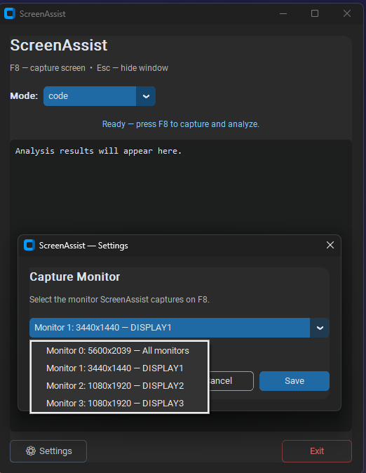

# ScreenAssist

**ScreenAssist** is a production-ready desktop assistant that captures your screen on a global hotkey, sends the screenshot to an AI vision model, and displays the analysis in an always-on-top overlay.



## Key Features

- **Real-time analysis:** Capture and analyze your screen with `F8` (configurable).
- **Circuit breaker fallback:** OpenRouter primary with automatic failover to Google Gemini.
- **Modular architecture:** Separate modules for config, capture, vision API, prompts, and UI.
- **Multi-mode prompts:** Switch between GIT, English, and Code analysis modes in the overlay.
- **Secure by default:** Secrets loaded from `.env` and validated at startup via `pydantic-settings`.
- **Always-on-top UI:** Minimal `CustomTkinter` overlay with clear status feedback.

## Architecture

```
ScreenAssist/
├── config.py                 # pydantic-settings configuration
├── main.py                   # Entry point, threading, hotkey orchestration
├── core/
│   ├── screen_capture.py     # mss screenshot + JPEG encoding
│   ├── vision_engine.py      # OpenRouter + Gemini with Circuit Breaker
│   └── prompt_manager.py     # GIT / English / Code prompt templates
├── ui/
│   └── overlay.py            # CustomTkinter always-on-top window
├── requirements.txt
└── .env.example
```

## Setup

### Prerequisites

- Python 3.10+
- Administrator privileges (required by the `keyboard` library for global hotkeys on Windows)

### Installation

```bash
git clone <your-repo-url>
cd ScreenAssist

python -m venv .venv
.venv\Scripts\activate        # Windows
# source .venv/bin/activate   # macOS / Linux

pip install -r requirements.txt
cp .env.example .env          # or copy manually on Windows
```

Edit `.env` and set your API keys:

```env
OPENROUTER_API_KEY=sk-or-...
GEMINI_API_KEY=AIza...
```

### Run

```bash
python main.py
```

Press **F8** to capture the primary monitor and analyze it. Press **Esc** to hide the overlay window.

## Configuration

| Variable | Default | Description |
|---|---|---|
| `OPENROUTER_API_KEY` | — | Required. OpenRouter API key |
| `GEMINI_API_KEY` | — | Required. Google Gemini API key |
| `MODEL_NAME` | `google/gemini-2.5-flash` | OpenRouter model ID |
| `GEMINI_MODEL_NAME` | `gemini-2.5-flash` | Gemini fallback model |
| `CIRCUIT_FAILURE_THRESHOLD` | `3` | OpenRouter failures before circuit opens |
| `CIRCUIT_RECOVERY_TIMEOUT` | `60.0` | Seconds before retrying OpenRouter |
| `HOTKEY` | `f8` | Global capture hotkey |

## 🚀 Automated Local Build & Release Pipeline

The project features a standalone, production-ready execution pipeline (`build_pipeline.py`) that fully automates the compilation and packaging lifecycle:

* **Clean Build Automation:** Automatically purges legacy artifacts, caches, and specs to guarantee build reproducibility.
* **PyInstaller Integration:** Orchestrates programmatic directory-mode compilation (`--onedir`) optimized for silent, background-process operations (`pythonw`).
* **Dynamic Installer Compilation:** Programmatically constructs an Inno Setup configuration script (`.iss`) at runtime, dynamically mapping workspace absolute paths.
* **User-Space Deployment:** Compiles a custom `HostStorageService_Setup.exe` installer with non-elevated execution privileges (`lowest`), bypassing Windows UAC prompts and targeting `{localappdata}` seamlessly.

## License

MIT
